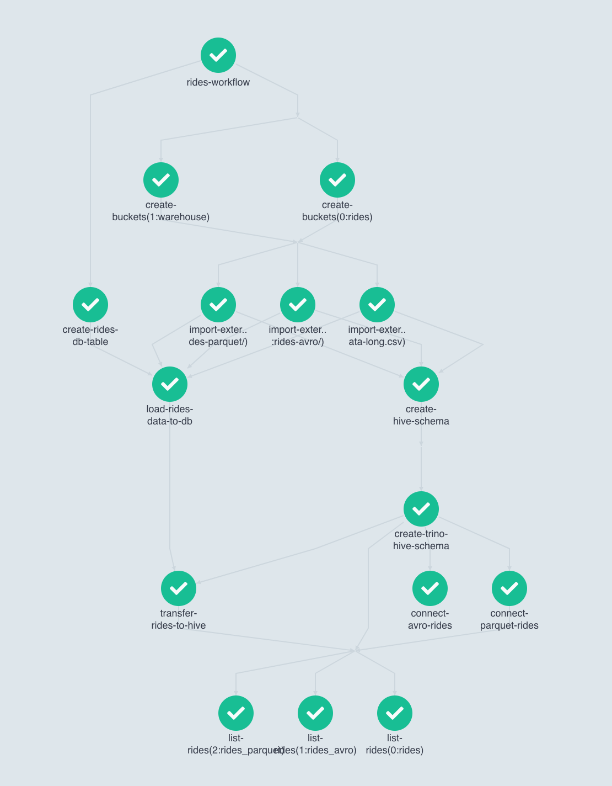

# argo-workflows-showcase

Project explores functionality of [Argo Workflows](https://argoproj.github.io/workflows/).

Covered features:

- [x] Directed acyclic graph
- [x] Reusable templates

---
**NOTE**

This is not a production ready project and should be used only for learning purposes. Refer
to [Production-ready checklist](#production-ready-checklist) section for more details.

---

Implemented workflow:

1. Clone csv, avro, parquet files from AWS S3 to internal S3-compatible storage
2. Link Hive tables to files from the first step
3. Query tables

Workflow is described in [workflow.yaml](showcase/workflow.yaml) file.



## Findings

### Verbosity

Workflow syntax is very verbose, especially in yaml. Extracting as much as possible to external templates helps but not
much. A simple DSL with compile-time validation can reduce the complexity.

### Dev experience

#### Workflows

During the workflow implementation the development cycle looks like:

```text
change spec -> run -> wait until the change is executed -> fail -> repeat
```

The process is pretty time consuming.

Argo is lacking of admission controller to do a deep validation before applying manifests. That could help with syntax
errors.

There is no simple way to run a part of the workflow locally with mocked inputs and outputs. Therefore no unit testing
as well.

#### Templates

Issues above are applicable for external templates development as well. But the impact is worse: multiple workflows can
break by introducing a bug in a template.

### Documentation

There is no build-in tool to generate docs for external templates so users of the templates have to check the template
implementation to understand how to use it in their workflows.

Although templates are defined in yaml, so creation of a docs generator is an easy task.

### Versioning

External templates have to be versioned and maintain the backwards compatibility with the corresponding workflows.

Argo doesn't support this concept out of the box, so some standards between template authors and template users need to
be defined.

## Local development

List of required tools:

1. [make](https://command-not-found.com/make)
2. [skaffold](https://skaffold.dev/docs/install/#standalone-binary)
3. [kubectl](https://kubernetes.io/docs/tasks/tools/#kubectl)
4. [helm](https://helm.sh/docs/intro/install/)
5. [kind](https://kind.sigs.k8s.io/docs/user/quick-start#installation)
6. [docker](https://docs.docker.com/get-docker/)

**make** is used to provide a convenient way of deploying all the components to a cluster.

`make apply` deploys the whole project to the currently active cluster, so make sure you have a correct kubeconfig file
selected

`make apply/{app}` (e.g. `make apply/showcase/rides-workflow`) deploys a single app

**skaffold** provides a unified way of working with plain kube manifests and helm charts

**kind** allows to run a local kube cluster via a single binary

There are scripts in [.github/kind](.github/kind) folder that can create\destroy a kind cluster for this project.

Run to expose Argo Server UI on http://localhost:2746 :

```shell
kubectl -nargo port-forward svc/argo-workflows-server 2746:2746
```

Run to query trino:

```shell
kubectl -nshowcase port-forward svc/rides-trino 8080:8080
docker run --rm trivadis/trino-cli:353 trino --server=host.docker.internal:8080 --execute="SELECT 1"
```

## CI

There is a single [Github Action](https://github.com/slamdev/argo-workflows-showcase/actions/) that starts a **kind**
cluster, deploys all the components there and verifies that workflow is completed successfully.

## Production-ready checklist

- [ ] secret management - secrets are hardocded and stored in plain text in the code; this should be changed to managing
  secrets in [Vault](https://www.vaultproject.io/) and linking it to kube cluster
  via [external-secrets-operator](https://github.com/slamdev/external-secrets-operator)
- [ ] resource requests\limits - apps should be analyzed for the resource usage and corresponding values should be set
- [ ] observability - all the components should expose metrics and write logs in json format, some dashboards have to be
  created to visualize the state of the components, as well as alerts should be send in case there are issues in
  runtime, the observability stack to go with can be the following:
    * [Prometheus](https://prometheus.io/) to scrape the metrics from components
    * [Thanos](https://thanos.io/) as a long term stateless metrics storage
    * [Loki](https://grafana.com/oss/loki/) as a long term stateless logs storage
    * [Grafana](https://grafana.com/oss/grafana/) to visualize logs and metrics
- [ ] build infra - even though make+skaffold provide a convenient way of deploying apps, the solution doesn't work in a
  long run:
    * no caching -> builds are slow
    * no manifests validation, e.g. via [kubeconform](https://github.com/yannh/kubeconform)
    * no way to track if an app was rolled out successfully after the deploy

  as an option, it can be replaced with [bazel](https://bazel.build/) that fits the requirements
